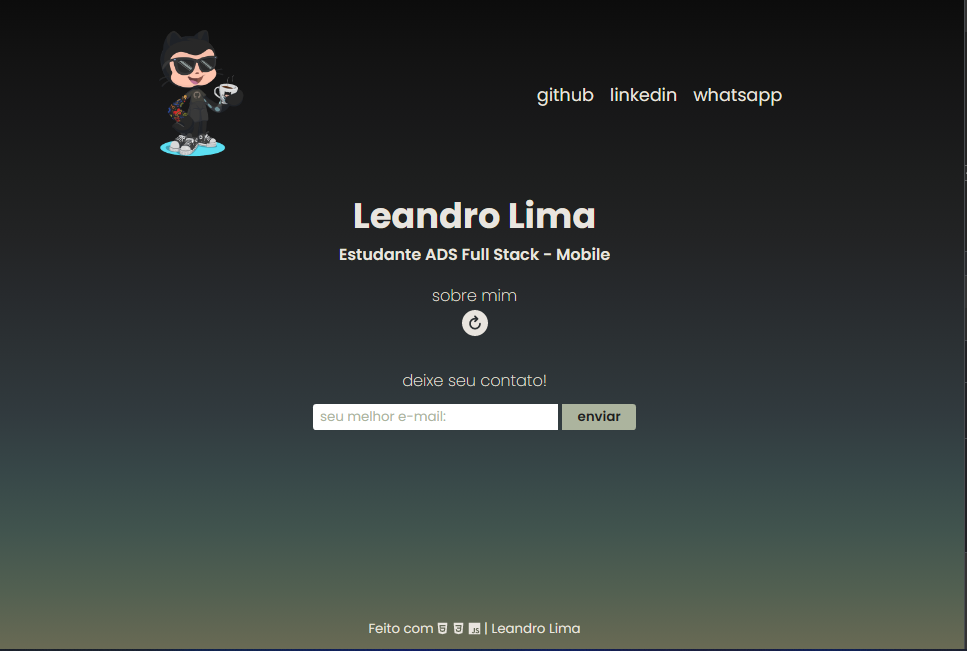
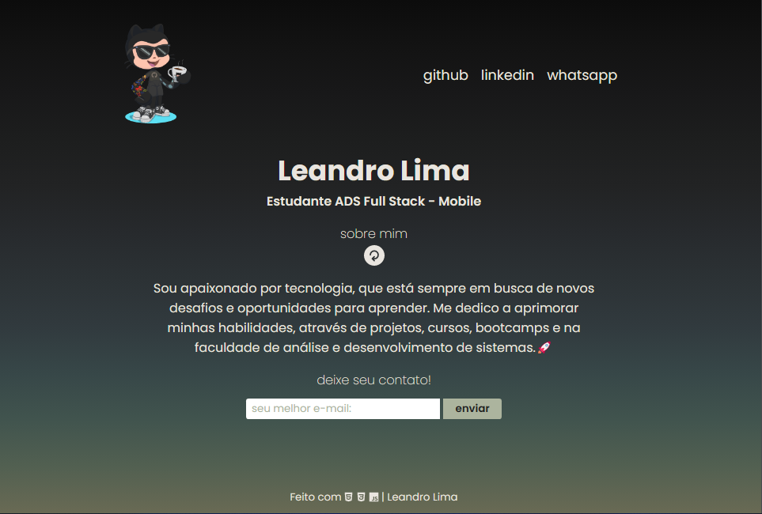

<h1 align="center">About Me</h1>

Projeto realizado no curso IBRF Tech - Dev Starter em parceria com a Gama Academy.

  <a href="#-tecnologias">Tecnologias</a>&nbsp;&nbsp;&nbsp;|&nbsp;&nbsp;&nbsp;
  <a href="#-projeto">Projeto</a>&nbsp;&nbsp;&nbsp;|&nbsp;&nbsp;&nbsp;
  <a href="#-layout">Layout</a>&nbsp;&nbsp;&nbsp;|&nbsp;&nbsp;&nbsp;
  <a href="#memo-licença">Licença</a>

  

 

  

  

## 🚀 Tecnologias

Esse projeto foi desenvolvido com as seguintes tecnologias:

- HTML5 e CSS3
- JavaScript
- Git e Github

## 💻 Projeto

Desenvolver um site pessoal, colocando em prática todo aprendizado das aulas de html, css e javascript.

## 🔖 Layout

- [Acesse aqui o projeto finalizado, online](https://site-aboutme.vercel.app/)

## :memo: Licença

Esse projeto está sob a licença MIT.

---

Feito com ♥ by Leandro Lima